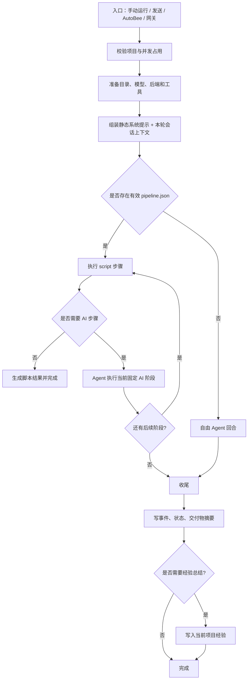

# WokBee 运行模型过程逻辑（产品视角）

本文按当前代码行为描述 WokBee 的运行过程，重点回答三个问题：任务从哪里进入、Agent 如何决定下一步、结果如何保存和反馈。文末列出需要产品继续确认的风险与取舍。

## 一、产品对象

WokBee 当前围绕一个“项目”运行。项目包含名称、目标、审核策略、项目目录、运行记录、交付物、脚本和项目经验。

- **项目目标**：运行模式的主要输入。没有目标时，用户点击“运行”会先被要求补充目标。
- **Agent**：一次运行中负责理解目标、调用模型和工具、处理异常并产出结果的执行者。
- **文件与执行工具**：文件读写、搜索、网络请求、命令执行、凭据读取、MCP 和 Skills。
- **有序管线**：项目目录中的 `scripts/pipeline.json`。它把已经验证过的流程固化为 script 或 ai 步骤。
- **项目运行经验**：保存在项目自己的 `memory/experiences/` 中，只用于帮助后续运行；不再使用全局记忆库、跨项目记忆或独立对话记忆。
- **事件时间线**：保存在项目的 `events.jsonl`，用于界面展示、运行诊断和经验总结材料。

## 二、四种入口

### 1. 手动“运行”

这是 WokBee 的主流程，目标是推进项目并尽量复用已经验证过的流程。

1. 用户选择项目，填写目标或本轮指令，点击“运行”。
2. 系统检查项目目标、运行状态和是否已有其他任务占用该项目。
3. 系统创建运行 Worker，设置项目状态为“运行中”，把用户指令写入事件时间线。
4. Runner 创建 Agent，加载本项目最新经验、工具、Skills、MCP、运行环境和审核策略。
5. 如果项目存在有效的 `pipeline.json`，系统按步骤顺序执行：
   - script 步骤直接执行，不调用模型，不消耗 Token；
   - ai 步骤把当前阶段材料交给 Agent，执行一个确定的业务阶段；
   - 当前阶段完成后继续下一阶段，最多执行配置的阶段数（默认上限 64）。
6. 如果没有有效管线，系统直接进入一次自由 Agent 运行，由 Agent 自己决定读取、分析、写入、执行和验证顺序。
7. 运行中如果遇到需要人工确认的操作，进入“待审批”；如果需要补充信息，弹出澄清问题。
8. 运行成功后更新项目状态、交付物摘要，并由 Agent 或系统兜底写入项目运行经验。
9. 运行失败时保留错误事件；如果本轮产生了新的修正方法，系统会尝试总结为失败修正经验。

产品上的核心含义是：**有管线的项目偏向稳定复跑，没有管线的项目偏向 Agent 自主执行。**

### 2. 手动“发送”

发送属于交互模式，不执行有序管线，适合询问、修改项目资料、补充文件或临时处理与项目目标无关的问题。

- 使用与运行模式相同的文件、网络、执行、Skills、MCP 和项目元数据工具。
- 会注入本项目最新经验，但不会自动运行经验管线。
- 可以修改项目名称、目标和项目文件，因此产品上它不是只读问答，而是“自由操作项目”。
- 成功后恢复进入对话前的项目状态，不会把项目直接标记为完成。
- 当前会话状态只在进程内 checkpointer 中保留；事件记录仍落盘供界面回看。

### 3. DeziBee“设计”

DeziBee 使用 Runner 的 design 模式，但它不是 WokBee 项目运行管线的一个阶段，而是独立的设计工作流。

- 只准备 `demo/`、`prd/`、`uploads/` 目录。
- 不创建或加载 WokBee 的 `memory/`、`workspace/`、`deliverables/`、`scripts/` 管线。
- 不注入项目运行经验，也不挂载经验写入工具。
- Agent 直接围绕原型和 PRD 工作，完成一轮设计后结束。
- 原始交互记录仍由 DeziBee 自己保存，用于界面历史展示；已删除独立的上下文总结和跨对话摘要。

### 4. AutoBee 和消息网关

AutoBee 是定时触发器，消息网关是手机或外部消息入口。它们都复用 WokBee 引擎，但运行方式不同。

**AutoBee：**

1. APScheduler 在线程池中触发任务。
2. 按项目 ID 加锁，避免同一项目同时运行多个任务。
3. 构造与手动运行相同的 `RunRequest`，默认使用项目目标或任务指令。
4. 自动跳过所有审批，适合无人值守，但也意味着文件写入、命令执行和网络操作不会等待用户确认。
5. 实时事件写入项目时间线，并通过 Qt 信号刷新桌面 UI。
6. 结束后更新 AutoBee 运行日志和 WokBee 项目状态，并可发送企业微信或个人微信通知。

**消息网关：**

1. 收件线程只负责去重和入队。
2. 分发线程池根据路由规则找到项目。
3. 使用 WokBee 的 chat 模式运行一轮交互，不走项目管线。
4. 审批自动放行；澄清问题优先发回手机，无法等待时自动选择第一项。
5. 事件写入项目时间线，回复文本发送回原消息渠道。

## 三、一次 Agent 运行内部发生什么

准备 Agent 时，系统会完成以下组合：

1. **模型**：按项目绑定模型、任务绑定模型或默认模型解析。
2. **项目后端**：默认只允许在项目虚拟目录内操作；额外目录必须通过白名单或 `request_access` 挂载。
3. **审核策略**：读、写、常规操作、高风险操作分别决定是否需要人工审批。
4. **环境信息**：项目目录、模型、审核策略、运行时环境、Skills 路径和附加目录会进入首条会话上下文。
5. **经验信息**：仅加载当前项目最新经验，不扫描历史经验和其他项目。
6. **工具集合**：网络、文件、命令、项目元数据、凭据、经验、询问用户、AutoBee 和 MCP 工具按模式挂载。

系统提示词保持稳定；变化的项目目标、经验和环境信息放在首条用户消息的“会话上下文”中。这样做的目的是避免每轮重写 system prompt，同时保留当前运行所需的项目状态。

## 四、状态与持久化

一次运行同时产生三类结果：

1. **用户可见结果**：时间线中的用户消息、Agent 回复、工具调用、错误、审批和完成提示。
2. **项目状态结果**：`运行中`、`待审批`、`完成`、`失败`、`空闲`等状态，以及当前步骤和交付物摘要。
3. **可复用结果**：脚本、`pipeline.json` 和 `memory/experiences/` 中的项目经验。

事件按追加方式写入 `events.jsonl`。项目元数据和索引使用原子写入；后台写入已经统一串行化，并避免为每条工具事件重复改写项目索引。

当前没有独立的全局记忆写入、跨项目召回、对话记忆提炼或 DeziBee 上下文摘要写入。项目运行经验仍然是唯一保留的“长期可复用知识”。

## 五、产品视角下需要继续确认的问题

以下不是代码错误，而是当前行为可能需要产品明确取舍的地方：

### P0：手动运行和自由 Agent 的边界

没有 `pipeline.json` 时，Agent 可以自行规划并连续调用工具；有管线时，Agent 只执行当前固定 AI 阶段，不重新规划。用户是否能理解“同一个运行按钮在两种项目状态下行为不同”，目前还不够直观。

### P0：无人值守的权限范围

AutoBee 和消息网关默认自动批准所有工具。它们适合自动化，但也允许自动写文件、执行命令和访问网络。需要确认是否要为 AutoBee 增加独立的“允许目录、允许工具、禁止命令”策略，而不是复用“全部免审”。

### P1：澄清问题的自动兜底

AutoBee 无法等待用户时会选择第一个选项；网关在手机答复超时或失败时也会这样做。这个策略能避免任务永久挂起，但在多选项业务中可能造成方向性错误。可以考虑改成“安全停止并报告待确认”，由用户决定是否继续。

### P1：经验总结的触发时机

Agent 可以在运行中主动调用 `update_project_experience`；首次运行结束或出现异常且 Agent 未写经验时，系统会兜底总结。普通的成功复跑不会自动产生新经验。需要确认产品是否希望每次成功运行都留下版本化经验，还是只保存有变化的经验。

### P1：对话记录与“对话记忆”的边界

独立对话记忆已经删除，但项目事件时间线和 DeziBee 交互记录仍然持久化，用于回看、诊断和当前功能。若产品要求“完全不保存历史对话”，还需要进一步关闭事件落盘和对应的 UI 回看能力。

### P2：同一项目的多入口协作

同一项目通过项目运行槽串行化，桌面运行、AutoBee 和网关不会同时执行；不同项目可以并行。当前用户界面没有明确展示“项目正在被其他入口占用”的来源，可能让用户误以为任务没有响应。

### P2：完成状态的含义

“成功”表示 Agent 流程结束或纯脚本管线成功，不一定代表所有业务目标都已被人工验收。产品上可以考虑把“执行成功”和“产物已验收”拆成两个状态。

## 六、当前版本的产品结论

WokBee 现在是“项目驱动的 Agent 执行器”：项目目标负责提出任务，有序管线负责复用稳定流程，Agent 负责处理需要理解和判断的阶段，项目经验负责沉淀可复用方法。手动运行、AutoBee 和网关共享执行内核，但审批、是否走管线、是否允许等待用户这三个策略不同，是当前最需要在产品层面解释清楚的部分。

建议下一步优先确认 P0 的两个问题：无管线时是否允许自由执行，以及 AutoBee 是否继续默认全部免审。这两项会直接决定用户对“运行按钮”和“自动任务”的安全预期。
